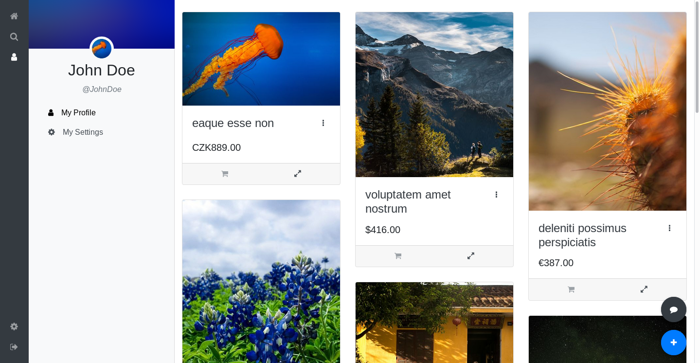

# Marketplace

**English:** A marketplace web application developed in PHP and TypeScript \(Laravel, Vue.js\), similar in functionality to Letgo or Facebook's Marketplace.

**Čeština:** Webová prodejní burza napsaná v PHP a TypeScriptu \(Laravel, Vue.js\), odpovídající funkčností aplikacím typu Letgo nebo Facebook Marketplace.

* Documentation/Dokumentace
    * [English](https://kogli.github.io/marketplace)
    * [Čeština](https://kogli.github.io/marketplace/#/cs/README)
* [PHP Reference](https://kogli.github.io/marketplace/reference_docs/php/)
* [TypeScript Reference](https://kogli.github.io/marketplace/reference_docs/ts/)

