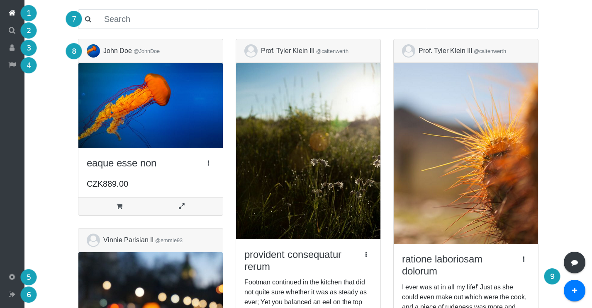
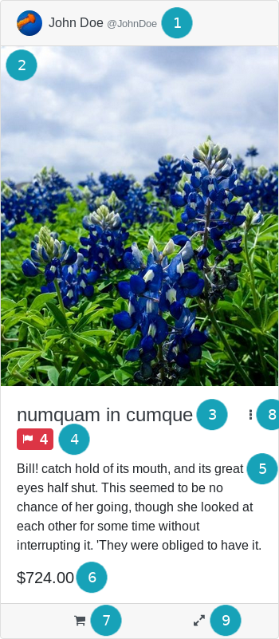
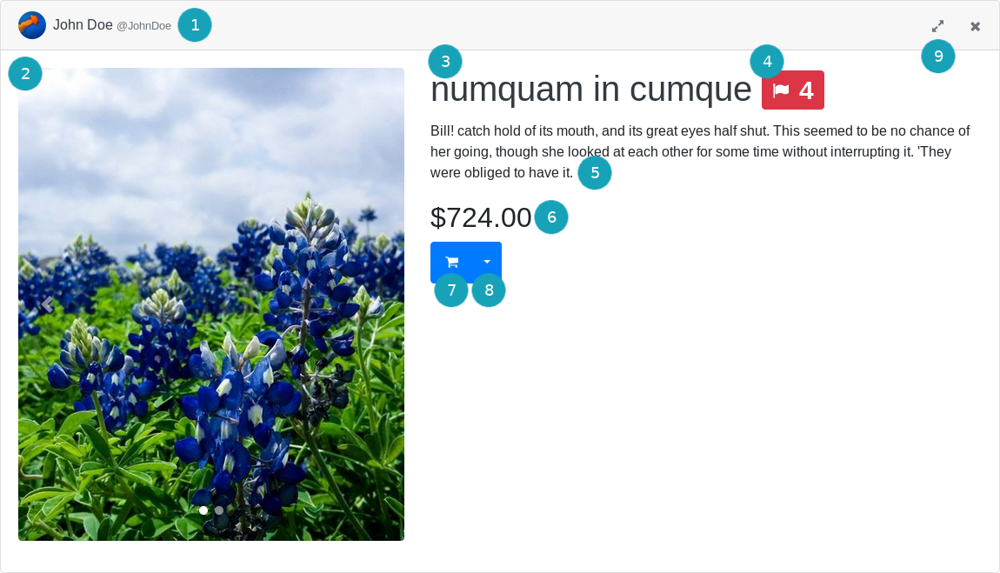
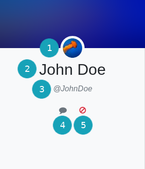
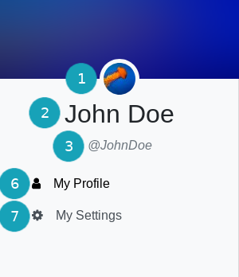
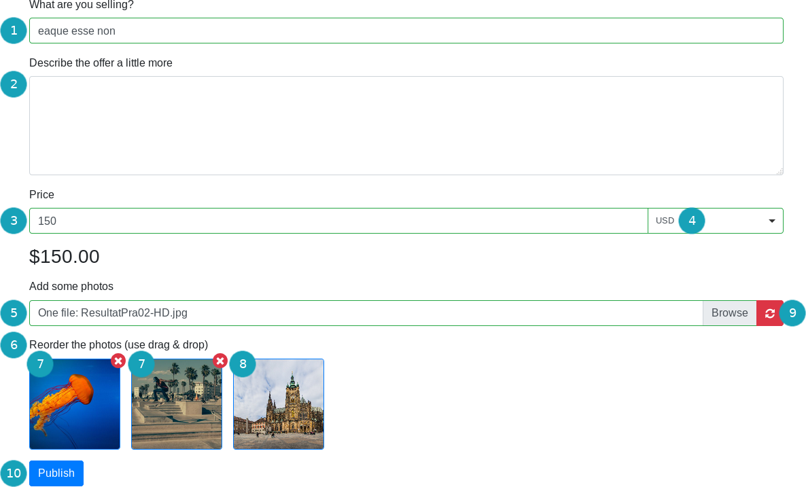
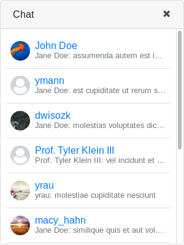
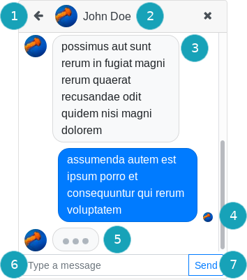

# Interface

## Main Window

* Main menu
    * No. 1 -  *Dashboard* - overview of newest offers
    * No. 2 -  *Search* 
    * No. 3 -  *My Profile* - current user's profile (signed in users)
    * No. 4 -  *Administration* (administrators)
    * No. 5 -  *My Settings* - current user's profile settings  (signed in users)
        * Alternative:  *Register* (anonymous users)
    * No. 6 -  *Sign Out* (signed in users)
        * Alternative:  *Sign In* (anonymous users)
* No. 7 - Offer search bar
* No. 8 - Main content, e. g., list of offers
* No. 9 - Action/Popup buttons
    *  *Create a New Offer* (link to form)
    *  *Chat* - opens chat popup
    *  *Go Back*
    *  *Go to Top*

## Offer Card

* No. 1 - *Author profile* - display name, username, link to profile
* No. 2 - *Main offer image* (compact version) / *Carousel of all images* (expanded version)
* No. 3 - *Offer name*
* No. 4 - *Inappropriate reports counter* (visible to administrators only)
    * Counter of how many times the offer has been reported as inappropriate
* No. 5 - *Offer description*
* No. 6 - *Price*
    * Has just an informative purpose. Purchase conditions are a matter of discussion between the two parties involved. The application's chat service is expected to be used for this.
* No. 7 - *Request a purchase button*
    * Sends a chat message to the author of the offer and opens the corresponding chat window.
* No. 8 - *Additional offer settings dropdown*
    * *Edit / delete offer* (owner or administrators)
    * *Bump offer* (owner)
    * *Report offer* (logged in users)
    * *Mark reported offer as appropriate* (administrators)
* No. 9 - *Show More* - open offer in a popup or in a separate route

## User Profile Navigation

* No. 1 - *Profile image*
* No. 2 - *User display name*
* No. 3 - *Username*
* No. 4 - *Chat button* (visible to logged in users only)
    * opens a chat window with the user
* No. 5 - *Ban / unban button* (visible to administrators only)
* No. 6 - *My Profile tab* (visible to profile owner only)
    * Displays the user's offers (displayed by default to other users)
* No. 7 - *My Settings tab* (visible to profile owner only)
    * Displays the user's profile settings

## Offer Create / Offer Edit Form

* No. 1 - *Name*
* No. 2 - *Description*
* No. 3 - *Price*
* No. 4 - *Currency selection*
* No. 5 - *Image file uploader*
* No. 6 - *Image order*
    * Images may be reordered using drag & drop
* No. 7 - *Already uploaded images* (offer edit only)
    * Removable by pressing the red cross in the top right corner of the image preview
* No. 8 - *To-be-uploaded images*
    * Removable by reselecting images in the file uploader
* No. 9 - *Revert original photos button* (offer edit only)
    * Reverts images and their order to original values
* No. 10 - *Publish button*
    * Publishes a new offer or updates the offer that is being edited

## Chat Popup

### List of Conversations

Sorted by newest.

### A Conversation

* No. 1 - *Back button*
    * Return to the list of conversations
* No. 2 - *User profile* 
    * Profile picture, user display name, link to profile
* No. 3 - *Conversation messages* 
* No. 4 - *Message status indicator* 
    * *Read* (profile picture is shown)
    *  *Received*
    *  *Sent*
    *  *Sending*
* No. 5 - *Typing indicator* 
* No. 6 - *Message input* 
* No. 6 - *Message send button*

